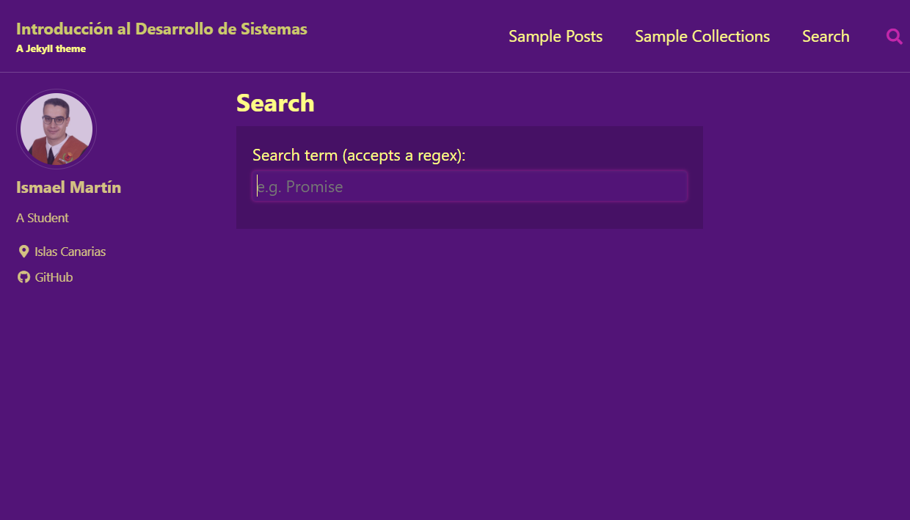
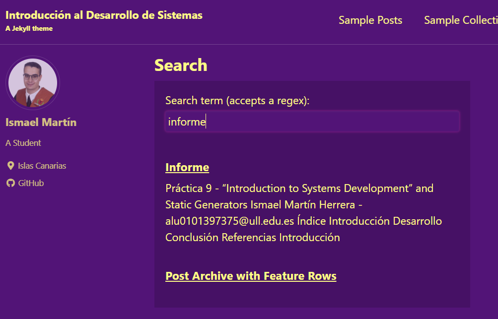
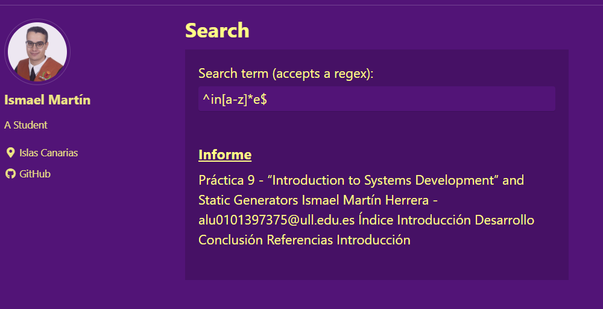

[](https://classroom.github.com/open-in-codespaces?assignment_repo_id=16598544)

# Práctica 10 - Jekyll search

Ismael Martín Herrera - _alu0101397375@ull.edu.es_

## Índice

1. [Introducción](#introducción)
2. [Desarrollo](#desarrollo)
3. [Resumen capítulo](#resumen-del-capítulo-2-del-libro-developing-information-systems)
4. [Referencias](#referencias)

## Introducción

En esta décima práctica de la asignatura se pretende implementar un buscador sobre la el website creado en la práctica anterior, mediante el uso de Jekyll. Para ello, se ha de crear un archivo JSON con la información de las páginas del website, y se ha de implementar un buscador que permita buscar en dicho archivo. Además, se ha creado creado un nuevo post con el resumen del capítulo 2 del libro "Developing Information Systems". 

## Desarrollo

### Creación del archivo JSON

Para la creación del archivo JSON he creado un fichero en el directorio `assets/src` llamado `search.json`. En este archivo se ha de incluir la información de las páginas del website, en el formato adecuado para que el buscador pueda leerlo. Para ello, hago uso del lenguaje de plantillas liquid con el que accedo a todas las páginas del website y extraigo la información necesaria. 

```json
---
layout: null
sitemap: false
---


[
  
  
    
    
      {
        "title": {{ doc.title | jsonify }},
        "excerpt": {{ doc.excerpt | markdownify | strip_html | jsonify }},
        "content": {{ doc.content | markdownify | strip_html | jsonify }},
        "url": {{ site.baseurl | append: doc.url | jsonify }}
      },
    
  
  
  

  
  {
    "title": {{ page.title | jsonify }},
    "excerpt": {{ page.excerpt | markdownify | strip_html | jsonify }},
    "content": {{ page.content | markdownify | strip_html | jsonify }},
    "url": {{ site.baseurl | append: page.url | jsonify }}
  },
  
]


{{ json | lstrip }}
```

Este fichero, una vez que se construye el website, se convierte en un archivo JSON con la información de todas las páginas del website. Y que se coloca de manera automática en el directorio `_site/assets/src` del website. Generando algo como lo siguiente. 

```json
[
  
  
    
    
      {
        "title": "Informe",
        "excerpt": "Práctica 9 - “Introduction to Systems Development” and Static Generators\n\nIsmael Martín Herrera - alu0101397375@ull.edu.es\n\nÍndice\n\n\n  Introducción\n  Desarrollo\n  Conclusión\n  Referencias\n\n\nIntroducción\n\n",
        "content": "Práctica 9 - “Introduction to Systems Development” and Static Generators\n\nIsmael Martín Herrera - alu0101397375@ull.edu.es\n\nÍndice\n\n\n  Introducción\n  Desarrollo\n  Conclusión\n  Referencias\n\n\nIntroducción\n\n",
        "url": "/intro2sd-ismael-martin-herrera-alu0101397375//post%20formats/informe/"
      },
    
      {
        "title": "Población de los municipios de Canarias",
        "excerpt": "En este post se hace uso de los datos guardados en formato JSON en el directorio _data/csvjson_p9.json para mostrar una tabla con la población de los municipios de Canarias.\n\n",
        "content": "En este post se hace uso de los datos guardados en formato JSON en el directorio _data/csvjson_p9.json para mostrar una tabla con la población de los municipios de Canarias.\n\n\n  \n    \n      Nombre del municipio\n      Población\n      Tipo de municipio\n    \n  \n  \n    \n        \n            Betancuria\n            789\n            Rural\n        \n    \n        \n            Artenara\n            1030\n            Rural\n        \n    \n        \n            Agulo\n            1085\n            Rural\n        \n    \n        \n            Vilaflor de Chasna\n            1767\n            Rural\n        \n    \n        \n            Hermigua\n            1795\n            Rural\n        \n    \n        \n            Fuencaliente de La Palma\n            1800\n            Rural\n        \n    \n        \n            Tejeda\n            1813\n            Rural\n        \n    \n        \n            Garafía\n            1830\n            Rural\n        \n    \n        \n            Barlovento\n            1897\n            Rural\n        \n    \n        \n            El Pinar de El Hierro\n            1971\n            Rural\n        \n    \n        \n            Alajeró\n            2029\n            Rural\n        \n    \n        \n            Puntagorda\n            2293\n            Rural\n        \n    \n        \n            Puntallana\n            2547\n            Rural\n        \n    \n        \n            Tijarafe\n            2598\n            Rural\n        \n    \n        \n            El Tanque\n            2813\n            Rural\n        \n    \n        \n            Fasnia\n            2849\n            Rural\n        \n    \n        \n            Vallehermoso\n            2873\n            Rural\n        \n    \n        \n            Valleseco\n            3750\n            Rural\n        \n    \n        \n            San Andrés y Sauces\n            4170\n            Rural\n        \n    \n        \n            Frontera\n            4329\n            Rural\n        \n    \n        \n            Tazacorte\n            4502\n            Rural\n        \n    \n        \n            Los Silos\n            4644\n            Rural\n        \n    \n        \n            Valle Gran Rey\n            4674\n            Rural\n        \n    \n        \n            Buenavista del Norte\n            4753\n            Rural\n        \n    \n        \n            San Juan de la Rambla\n            4864\n            Rural\n        \n    \n        \n            Villa de Mazo\n            4905\n            Rural\n        \n    \n        \n            Garachico\n            4920\n            Rural\n        \n    \n        \n            Valverde\n            5123\n            Urbano\n        \n    \n        \n            Haría\n            5382\n            Rural\n        \n    \n        \n            La Guancha\n            5561\n            Rural\n        \n    \n        \n            Arafo\n            5623\n            Rural\n        \n    \n        \n            Agaete\n            5633\n            Rural\n        \n    \n        \n            Breña Baja\n            5885\n            Rural\n        \n    \n        \n            Tinajo\n            6573\n            Rural\n        \n    \n        \n            Breña Alta\n            7199\n            Rural\n        \n    \n        \n            La Aldea de San Nicolás\n            7536\n            Rural\n        \n    \n        \n            Firgas\n            7581\n            Rural\n        \n    \n        \n            Vega de San Mateo\n            7682\n            Rural\n        \n    \n        \n            Moya\n            7870\n            Rural\n        \n    \n        \n            El Paso\n            7901\n            Rural\n        \n    \n        \n            Arico\n            8754\n            Rural\n        \n    \n        \n            El Sauzal\n            9005\n            Rural\n        \n    \n        \n            La Matanza de Acentejo\n            9054\n            Rural\n        \n    \n        \n            La Victoria de Acentejo\n            9170\n            Rural\n        \n    \n        \n            San Sebastián de La Gomera\n            9342\n            Urbano\n        \n    \n        \n            Valsequillo de Gran Canaria\n            9490\n            Rural\n        \n    \n        \n            Santiago del Teide\n            11162\n            Rural\n        \n    \n        \n            Tegueste\n            11359\n            Rural\n        \n    \n        \n            Teror\n            12667\n            Rural\n        \n    \n        \n            Antigua\n            12940\n            Rural\n        \n    \n        \n            Santa María de Guía de Gran Canaria\n            13838\n            Rural\n        \n    \n        \n            Santa Úrsula\n            15114\n            Rural\n        \n    \n        \n            Santa Cruz de La Palma\n            15361\n            Urbano\n        \n    \n        \n            Tuineje\n            15572\n            Rural\n        \n    \n        \n            Yaiza\n            16924\n            Rural\n        \n    \n        \n            El Rosario\n            17750\n            Rural\n        \n    \n        \n            Santa Brígida\n            18341\n            Rural\n        \n    \n        \n            San Bartolomé\n            18989\n            Rural\n        \n    \n        \n            Mogán\n            20331\n            Rural\n        \n    \n        \n            Los Llanos de Aridane\n            20551\n            Urbano\n        \n    \n        \n            Pájara\n            20751\n            Rural\n        \n    \n        \n            Tías\n            21083\n            Rural\n        \n    \n        \n            Güímar\n            21224\n            Rural\n        \n    \n        \n            Guía de Isora\n            21711\n            Rural\n        \n    \n        \n            San Miguel de Abona\n            21915\n            Rural\n        \n    \n        \n            Teguise\n            23411\n            Rural\n        \n    \n        \n            Icod de los Vinos\n            23496\n            Rural\n        \n    \n        \n            Gáldar\n            24567\n            Rural\n        \n    \n        \n            Tacoronte\n            24592\n            Rural\n        \n    \n        \n            La Oliva\n            27945\n            Rural\n        \n    \n        \n            Candelaria\n            28485\n            Rural\n        \n    \n        \n            Puerto de la Cruz\n            30349\n            Urbano\n        \n    \n        \n            Ingenio\n            31932\n            Urbano\n        \n    \n        \n            Agüimes\n            32067\n            Urbano\n        \n    \n        \n            Los Realejos\n            37076\n            Urbano\n        \n    \n        \n            Arucas\n            38369\n            Urbano\n        \n    \n        \n            Puerto del Rosario\n            42024\n            Urbano\n        \n    \n        \n            La Orotava\n            42434\n            Urbano\n        \n    \n        \n            Adeje\n            49270\n            Urbano\n        \n    \n        \n            Granadilla de Abona\n            52447\n            Urbano\n        \n    \n        \n            San Bartolomé de Tirajana\n            52936\n            Urbano\n        \n    \n        \n            Arrecife\n            63750\n            Urbano\n        \n    \n        \n            Santa Lucía de Tirajana\n            74560\n            Urbano\n        \n    \n        \n            Arona\n            82982\n            Urbano\n        \n    \n        \n            Telde\n            102472\n            Urbano\n        \n    \n        \n            San Cristóbal de La Laguna\n            157815\n            Urbano\n        \n    \n        \n            Santa Cruz de Tenerife\n            208688\n            Urbano\n        \n    \n        \n            Las Palmas de Gran Canaria\n            378797\n            Urbano\n        \n    \n  \n\n\n\n  Fuente: Datos obtenidos del Instituto Canario de Estadística\n\n",
        "url": "/intro2sd-ismael-martin-herrera-alu0101397375//municipios/"
      },
    
      {
        "title": "Resumen de la lectura",
        "excerpt": "Lectura: Introducción to Systems Development\n\n",
        "content": "Lectura: Introducción to Systems Development\n\nEn este post se presenta un resumen de la lectura del capítulo 1 del libro “Developing Information Systems: Practical guidance for IT professionals” de Tahir Ahmed, James Cadle, y otros.\n\n\n  Ahmed, Tahir, et al. Developing Information Systems : Practical guidance for IT professionals, edited by James Cadle, BCS Learning &amp; Development Limited, 2014. ProQuest Ebook Central, http://ebookcentral.proquest.com/lib/bull-ebooks/detail.action?docID=1713962.\n\n\nResumen\n\nEl desarrollo de sistemas engloba una serie de pasos a seguir. En primer lugar, realizar un estudio de factibilidad para analizar si el proyecto puede valer la pena. En segundo lugar, la obtención de los requisitos. Posteriormente, el diseño de la solución, la programación del sistema y el testeo del mismo. Y por último su implementación. Asimismo, también existen un conjunto de disciplinas adicionales que intervienen en el proceso de desarrollo de sistemas. Desde la gestión de proyectos, en la que el “project manager” planifica las tareas y moviliza los recursos necesarios. Pasando por el análisis del negocio, encargado de estudiar la situación del mismo, así como sus necesidades, y que por tanto facilita la obtención de los requisitos del propio sistema. Y por otro lado, la arquitectura de sistemas, la programación, el testeo, la gestión de la configuración del sistema y el control de calidad.\n\nActualmente, el desarrollo de sistemas también se ha visto afectado por dos tendencias crecientes, la deslocalización y la subcontratación. Respecto a la deslocalización, muchas organizaciones han visto que en muchas ocasiones utilizar los recursos en determinados países, distintos al de la propia compañía, como pueden ser el caso de India o países post soviéticos, es más barato. Y además, de buena calidad, como es el caso precisamente de India, país en el que su sistema educativo fomenta a los graduados en carreras tecnológicas. Sin embargo, esta deslocalización también lleva implícitas algunas desventajas como pueden ser los problemas de comunicación, entre otras cuestiones por los husos horarios, o el idioma. Y por otro lado, la subcontratación, aunque puede tener su relación con la deslocalización no tiene por qué, e implica que ciertas organizaciones delegan la gestión de sus sistemas de TI a otras empresas, delegando a su vez el riesgo que implican, pero a cambio de un importante presupuesto y de la pérdida de control sobre sus propios sistemas.\n\n",
        "url": "/intro2sd-ismael-martin-herrera-alu0101397375//resumen/"
      },
    
  
    
    
      {
        "title": "Introducción a C++",
        "excerpt": "C++ es un lenguaje de programación de propósito general que combina características de programación de bajo nivel y de alto nivel. Es muy utilizado en sistemas embebidos, desarrollo de videojuegos, aplicaciones de alto rendimiento y sistemas operativos. Fue creado por Bjarne Stroustrup como una extensión del lenguaje C, añadiendo soporte para programación orientada a objetos.\n\n",
        "content": "C++ es un lenguaje de programación de propósito general que combina características de programación de bajo nivel y de alto nivel. Es muy utilizado en sistemas embebidos, desarrollo de videojuegos, aplicaciones de alto rendimiento y sistemas operativos. Fue creado por Bjarne Stroustrup como una extensión del lenguaje C, añadiendo soporte para programación orientada a objetos.\n\nCaracterísticas principales\n\n\n  Orientado a objetos: C++ soporta los conceptos fundamentales de la programación orientada a objetos, como clases, herencia, y polimorfismo.\n  Control manual de memoria: Los desarrolladores pueden gestionar manualmente la memoria, lo que ofrece un gran control, pero también requiere mayor precaución.\n  Alta eficiencia: C++ es conocido por su rendimiento. Se utiliza en sistemas donde la eficiencia y el control sobre los recursos son esenciales.\n\n\nCódigo de ejemplo\n\n// Este es un ejemplo básico en C++\n#include &lt;iostream&gt;\nusing namespace std;\n\nvoid saludo(string nombre) {\n    cout &lt;&lt; \"Hola, \" &lt;&lt; nombre &lt;&lt; \"!\" &lt;&lt; endl;\n}\n\nint main() {\n    saludo(\"Mundo\");\n    return 0;\n}\n\nCasos de uso\n\n\n  Desarrollo de videojuegos: C++ es ampliamente utilizado en motores de videojuegos como Unreal Engine, debido a su alto rendimiento.\n  Sistemas embebidos: Muchas aplicaciones de sistemas embebidos utilizan C++ debido a su capacidad de control preciso del hardware.\n  Aplicaciones de alto rendimiento: Programas que requieren velocidad y eficiencia, como simuladores o software financiero, son frecuentemente escritos en C++.\n\n\nVentajas y desventajas\n\n\n  \n    \n      Ventajas\n      Desventajas\n    \n  \n  \n    \n      Alta eficiencia y control del hardware\n      Manejo manual de memoria puede ser complicado\n    \n    \n      Soporte para programación orientada a objetos\n      Curva de aprendizaje pronunciada\n    \n    \n      Gran compatibilidad con C\n      Más propenso a errores complejos como fugas de memoria\n    \n  \n\n\nRecursos adicionales\n\nSi quieres aprender más sobre C++, estos recursos son un buen punto de partida:\n\n\n  Documentación de C++ en cplusplus.com\n  Curso de C++ en LearnCpp.com\n  C++ en la Guía de Programación de Microsoft\n\n\nC++ es un lenguaje extremadamente potente y versátil, ideal para proyectos que demandan alto rendimiento. ¡Anímate a explorarlo más a fondo!\n",
        "url": "/intro2sd-ismael-martin-herrera-alu0101397375//programming/c++/"
      },
    
      {
        "title": "Introducción a JavaScript",
        "excerpt": "JavaScript es uno de los lenguajes de programación más populares en el desarrollo web. Es ampliamente utilizado para crear aplicaciones interactivas y dinámicas en el lado del cliente, aunque también puede ejecutarse en el servidor gracias a Node.js.\n\n",
        "content": "JavaScript es uno de los lenguajes de programación más populares en el desarrollo web. Es ampliamente utilizado para crear aplicaciones interactivas y dinámicas en el lado del cliente, aunque también puede ejecutarse en el servidor gracias a Node.js.\n\nCaracterísticas principales\n\n\n  Lenguaje basado en eventos: JavaScript es perfecto para manejar eventos como clics de usuario, cambios en formularios y otras interacciones del navegador.\n  Ejecución en el navegador: JavaScript se ejecuta directamente en el navegador, lo que permite crear aplicaciones web interactivas sin necesidad de recargar la página.\n  Multiparadigma: JavaScript soporta programación orientada a objetos, funcional y basada en eventos, dándole mucha flexibilidad a los desarrolladores.\n\n\nCódigo de ejemplo\n\n// Este es un ejemplo básico en JavaScript\nfunction saludo(nombre) {\n    return `Hola, ${nombre}!`;\n}\n\nconsole.log(saludo(\"Mundo\"));\n\nCasos de uso\n\n\n  Desarrollo web: JavaScript es el pilar fundamental de la web, junto con HTML y CSS. Bibliotecas como jQuery y frameworks como React y Angular facilitan el desarrollo de interfaces de usuario.\n  Aplicaciones del lado del servidor: Node.js permite a los desarrolladores ejecutar JavaScript en el servidor, lo que lo convierte en un lenguaje de pila completa.\n  Aplicaciones móviles: Frameworks como React Native y Ionic permiten crear aplicaciones móviles utilizando JavaScript.\n\n\nVentajas y desventajas\n\n\n  \n    \n      Ventajas\n      Desventajas\n    \n  \n  \n    \n      Ejecutado en todos los navegadores\n      Puede generar problemas de seguridad si no se maneja correctamente\n    \n    \n      Gran soporte de comunidad\n      Diferencias entre navegadores pueden complicar el desarrollo\n    \n    \n      Extensiones y bibliotecas abundantes\n      No tiene tipado estático, lo que puede ocasionar errores difíciles de detectar\n    \n  \n\n\nRecursos adicionales\n\nPara aprender más sobre JavaScript, te recomiendo los siguientes enlaces:\n\n\n  Documentación de Mozilla Developer Network (MDN)\n  JavaScript en W3Schools\n  Curso interactivo en freeCodeCamp\n\n\nJavaScript es una herramienta poderosa y flexible. ¡Sigue aprendiendo y explorando!\n\n",
        "url": "/intro2sd-ismael-martin-herrera-alu0101397375//programming/javascript/"
      },
    
      {
        "title": "Introducción a Python",
        "excerpt": "Python es un lenguaje de programación altamente popular por su simplicidad y flexibilidad. Es utilizado tanto por principiantes como por profesionales para una gran variedad de tareas, desde desarrollo web hasta ciencia de datos e inteligencia artificial.\n\n",
        "content": "Python es un lenguaje de programación altamente popular por su simplicidad y flexibilidad. Es utilizado tanto por principiantes como por profesionales para una gran variedad de tareas, desde desarrollo web hasta ciencia de datos e inteligencia artificial.\n\nCaracterísticas principales\n\n\n  Sintaxis simple: Python utiliza una sintaxis clara y legible, lo que lo hace más fácil de aprender que otros lenguajes de programación.\n  Lenguaje interpretado: Esto significa que no necesitas compilar tu código antes de ejecutarlo. Python interpreta el código línea por línea.\n  Tipado dinámico: No es necesario declarar el tipo de una variable. Python asigna automáticamente el tipo en tiempo de ejecución.\n\n\nCódigo de ejemplo\n\n# Este es un ejemplo básico en Python\ndef saludo(nombre):\n    return f\"Hola, {nombre}!\"\n\nprint(saludo(\"Mundo\"))\n\nCasos de uso\n\n\n  Desarrollo web: Frameworks como Django y Flask permiten desarrollar aplicaciones web de manera rápida y sencilla.\n  Ciencia de datos: Librerías como NumPy, Pandas y Matplotlib facilitan el análisis y visualización de datos.\n  Inteligencia artificial: Herramientas como TensorFlow y PyTorch están diseñadas para construir modelos de machine learning y deep learning.\n\n\nVentajas y desventajas\n\n\n  \n    \n      Ventajas\n      Desventajas\n    \n  \n  \n    \n      Facilidad de aprendizaje\n      Menor rendimiento comparado con C\n    \n    \n      Gran cantidad de librerías\n      No ideal para aplicaciones móviles\n    \n    \n      Comunidad activa\n      Tipado dinámico puede generar bugs\n    \n  \n\n\nRecursos adicionales\n\nSi quieres aprender más sobre Python, aquí hay algunos enlaces útiles:\n\n\n  Documentación oficial de Python\n  Curso de Python en Codecademy\n  Tutoriales y cursos en Real Python\n\n\n¡Sigue practicando y explorando el mundo de Python!\n\n",
        "url": "/intro2sd-ismael-martin-herrera-alu0101397375//programming/python/"
      }
]
```

### Implementación del la búsqueda 

Para la implementación de la búsqueda he creado un script en el directorio `assets/src` llamado `search.js`. En el que se define la clase `JekyllSearch` que se encarga de realizar la búsqueda en el archivo JSON creado anteriormente. 

```javascript
class JekyllSearch {
    constructor(dataSource, searchField, resultsList, siteURL) {
      this.dataSource = dataSource
      this.searchField = document.querySelector(searchField)
      this.resultsList = document.querySelector(resultsList)
      this.siteURL = siteURL
  
      this.data = [];
    }
  
    fetchedData() {
      return fetch(this.dataSource, {mode: 'no-cors'})
        .then(blob => blob.json())
    }
  
    async findResults() {
      this.data = await this.fetchedData()
      const regex = new RegExp(this.searchField.value, 'i')
      return this.data.filter(item => {
        return item.title.match(regex) || item.content.match(regex)
      })
    }
  
    async displayResults() {
      const results = await this.findResults()
      //console.log('this.siteURL = ',this.siteURL)
  
      const html = results.map(item => {
        //console.log(item)
        return `
          <li class="result">
              <article class="result__article  article">
                  <h4>
                    <a href="${item.url}">${item.title}</a>
                  </h4>
                  <p>${item.excerpt}</p>
              </article>
          </li>`
      }).join('')
      if ((results.length == 0) || (this.searchField.value == '')) {
        this.resultsList.innerHTML = `<p>Sorry, nothing was found</p>`
      } else {
        this.resultsList.innerHTML = html
      }
    }
  
    init() {
      console.log("init")
      const url = new URL(document.location)
      if (url.searchParams.get("search")) {
        this.searchField.value = url.searchParams.get("search")
        this.displayResults()
      }
      this.searchField.addEventListener('keyup', () => {
        this.displayResults()
        // So that when going back in the browser we keep the search
        url.searchParams.set("search", this.searchField.value)
        window.history.pushState('', '', url.href)
      })
      
      // to not send the form each time <enter> is pressed
      this.searchField.addEventListener('keypress', event => {
        if (event.keyCode == 13) {
          event.preventDefault()
        }
      })
    }
  }
```

Y por otro lado, he incoporado tal y como se sugiere en el guión de la práctica, un script en el directorio `assets/src` llamado `fetch.js`, que es un código de tipo Polyfill para el método `fetch` de JavaScript, que permite proveer funcionalidades a navegadores que no soportan el método `fetch`. 

### Página de búsqueda

Finalmente, he creado una página en el directorio `pages` llamada `search.md` en la que se incluye el siguiente código y que es la que se encarga de mostrar el buscador en el website, junto con la lista de resultados y sus enlaces. 

```md
---
permalink: /search/
title: Search
---




<form id="search-form" action="">
  <label class="label" for="search">Search term (accepts a regex):</label>
  <br/>
  <input class="input" id="search" type="text" name="search" 
        autofocus 
        placeholder="e.g. Promise" 
        autocomplete="off">
  
  <ul class="list  list--results" id="list">
  </ul>
</form>

<script type="text/javascript" src='{{site.baseurl}}/assets/src/fetch.js'></script>
<script type="text/javascript" src='{{site.baseurl}}/assets/src/search.js'></script>


<script type="text/javascript">
  const search = new JekyllSearch(
    '{{site.baseurl}}/assets/src/search.json',
    '#search',
    '#list',
    '{{site.baseurl}}'
  );
  search.init(); 
</script>

<noscript>Please enable JavaScript to use the search form.</noscript>



{{ initSearch | lstrip }}

```

### Resultado

Como resultado se obtiene un buscador en el website que permite buscar en todas las páginas del website, y que muestra los resultados en una lista con los títulos de las páginas y un resumen de las mismas, permitiendo además el uso de expresiones regulares en la búsqueda. Además, de que se va actualizando continuamente según se va escribiendo en el campo de búsqueda.







## Resumen del capítulo 2 del libro "Developing Information Systems"

## Referencias


[[1] Enunciado de la práctica](https://ull-esit-dmsi.github.io/tema1-introduccion/practicas/jekyll-search/)